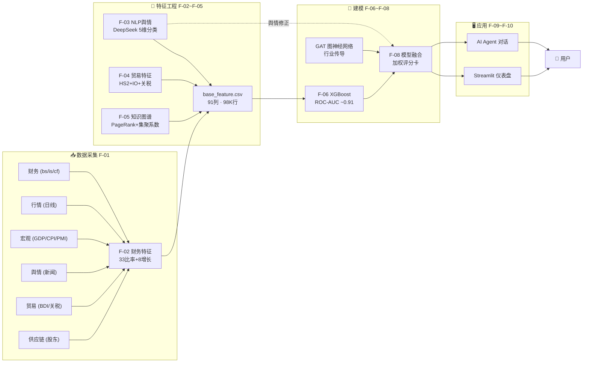
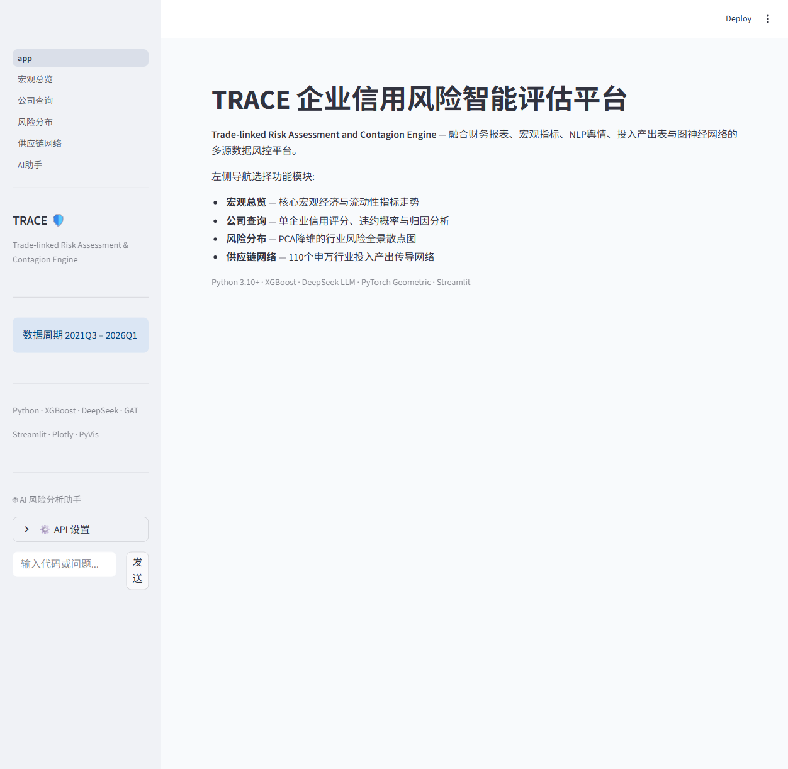
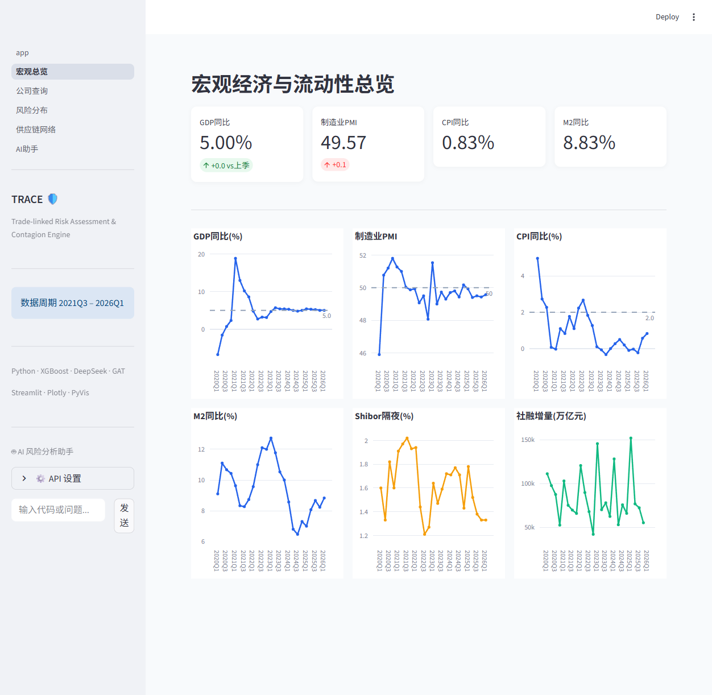
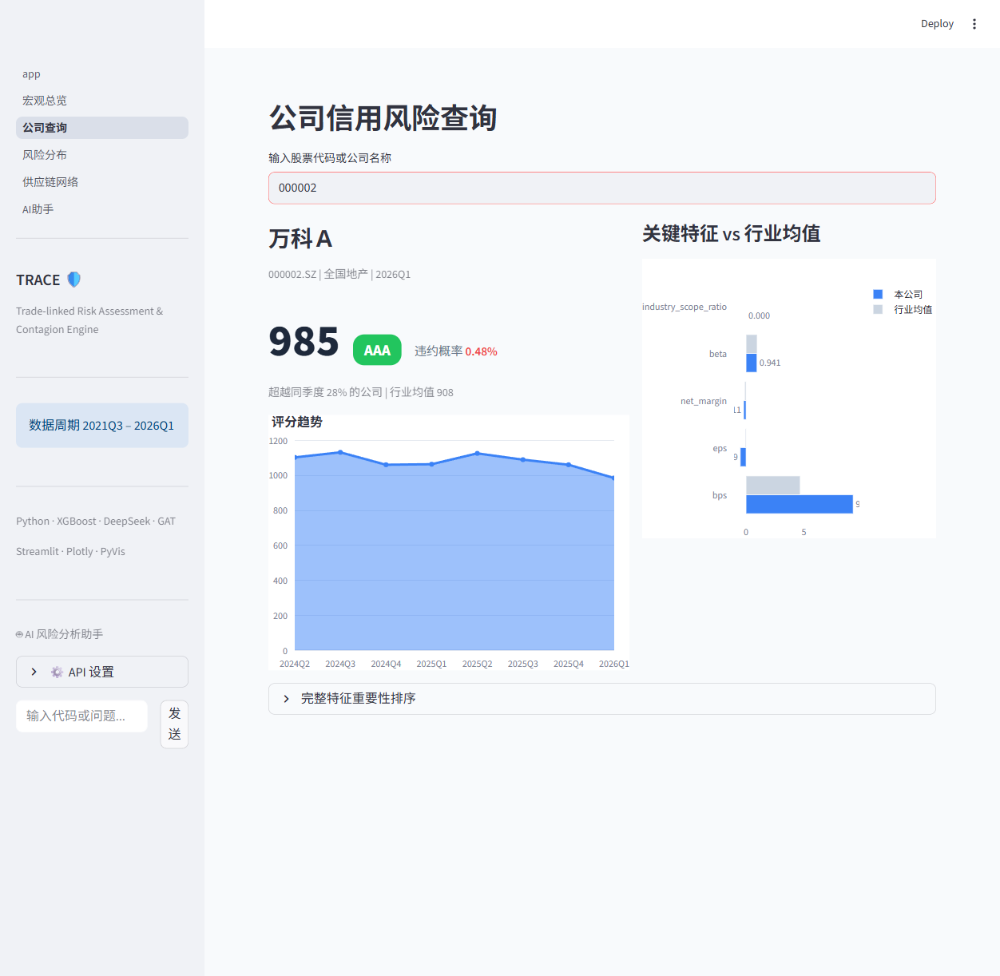
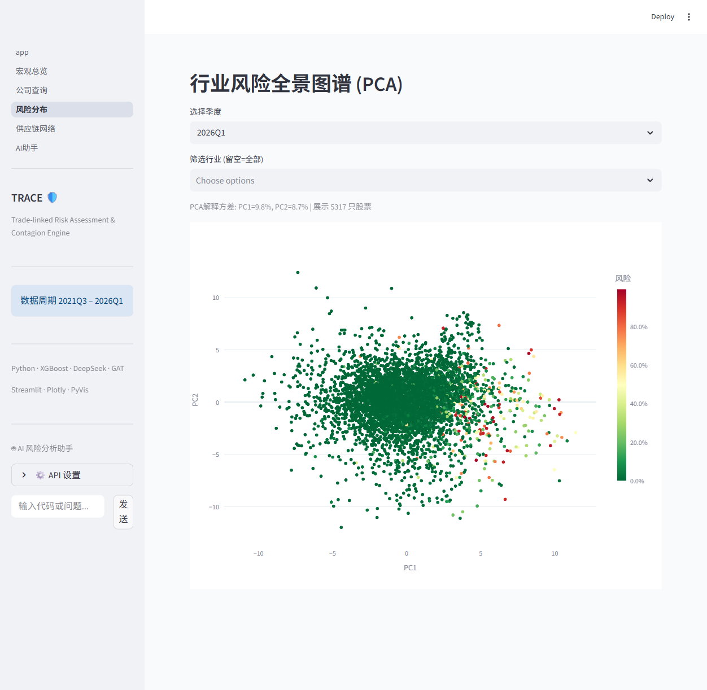
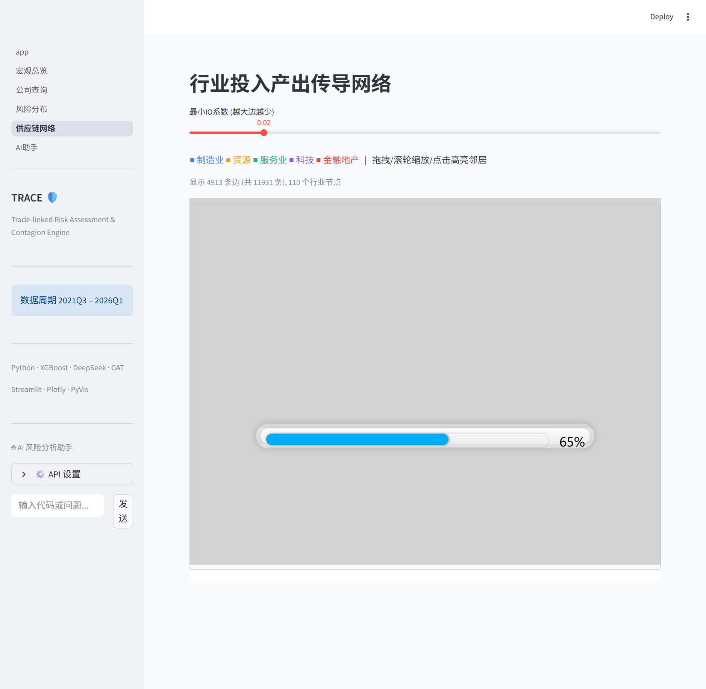
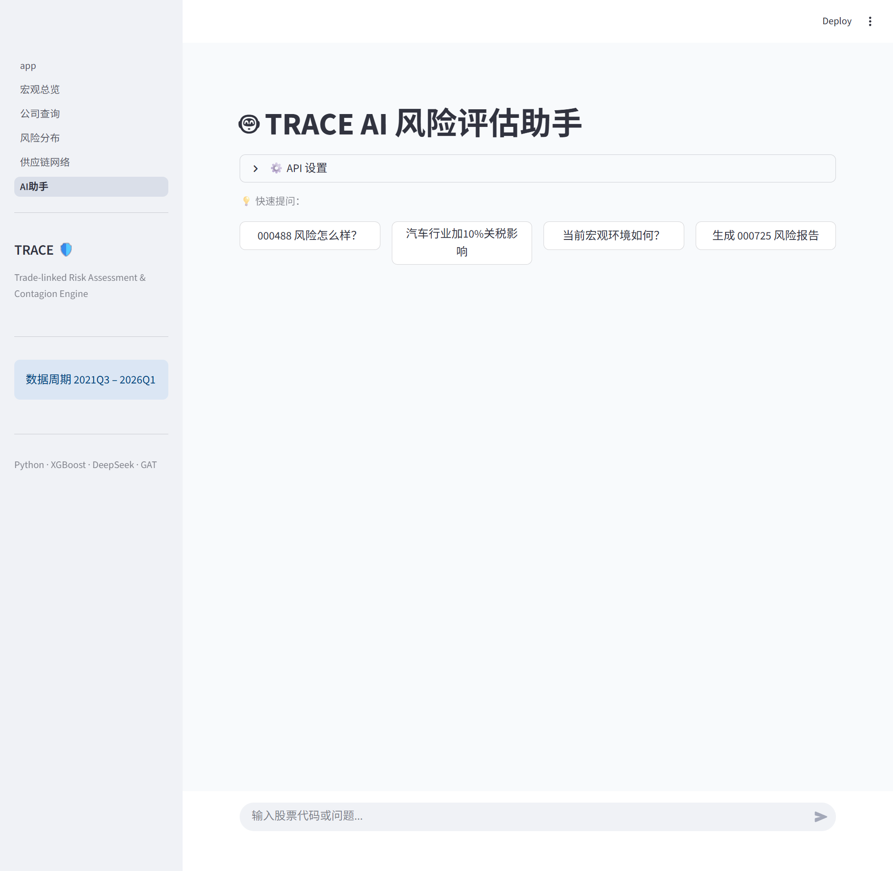

# 🛡️ TRACE — 多源融合的企业风险智能评估与传导预警平台

<div align="center">


[](https://trace-risk-platform.streamlit.app)

**T**rade-linked **R**isk **A**ssessment and **C**ontagion **E**ngine

[功能特性](#-核心特性) ·
[快速开始](#-快速开始) ·
[架构](#-系统架构) ·
[模块说明](#-功能模块) ·
[技术栈](#-技术栈)

</div>

---

## 🎯 项目定位

TRACE 是一个 **多源数据融合的企业信用风险评估平台**，面向金融机构信用研究员、银行风控人员与基金经理，提供高精度违约预测、供应链传导预警、NLP 舆情修正与 AI Agent 自然语言交互。

**核心思路**：传统信用评估依赖单一财务报表，存在滞后性。TRACE 将 **财务报表 + 市场行情 + 宏观指标 + 供应链网络 + NLP 舆情 + 国际贸易因素** 六维数据融合，通过 XGBoost + GAT 图神经网络进行违约预测与传导建模，最终以 Streamlit 仪表盘和 AI Agent 对话呈现结果。

> 📌 **求职定位**：项目结合了计算机科学基础与国际贸易经济学知识，特别擅长捕捉外贸企业受汇率、BDI、关税等国际贸易因素冲击的动态风险——与纯计算机背景候选人的明显区隔。

---

## ✨ 核心特性

<div align="center">

| 🧩 多维融合 | 🔗 供应链传导 | 📰 NLP 舆情 |
|:--:|:--:|:--:|
| 91 列特征宽表 | GAT 图注意力网络 | DeepSeek LLM 5 维分类 |
| 财报 + 行情 + 宏观 + 贸易 | 42 部门 IO 投入产出矩阵 | 200K 条新闻结构化标签 |
| 2021Q3–2026Q1, 98K 行 | 111 申万行业传导网络 | 季度情感聚合 9 特征 |

| 🌏 贸易特色 | 🤖 AI Agent | 📊 可视化 |
|:--:|:--:|:--:|
| HS2 进出口 + 关税模拟 | DeepSeek 函数调用 | Streamlit 5 页仪表盘 |
| 海外收入 + 汇率弹性 | 风险查询/传导追溯/报告生成 | Plotly + PyVis 交互图表 |
| BDI + SCFI 运费 | 自然语言 → 工具链 | 评分卡 + PCA + 网络图 |

</div>

---

## 🏗️ 系统架构



---

## 📊 数据全景

### 核心数据文件

| 文件 | 大小 | 行数 | 描述 |
|------|------|------|------|
| `stock_daily.csv` | 601 MB | 6,500K | 全 A 股日线 OHLCV，5,500 只股票 |
| `balance_sheet.csv` | 40 MB | ~103K | 资产负债表，41 列 |
| `income_statement.csv` | 33 MB | ~103K | 利润表，33 列 |
| `cash_flow.csv` | 29 MB | ~103K | 现金流量表，30 列 |
| `news_raw.csv` | 47 MB | 448K | 原始新闻标题，5 来源 |
| `market_quarterly.csv` | 13 MB | 97K | 季度收益率、波动率、回撤、Beta |

### base_feature.csv — 特征宽表（91 列 × 98,578 行）

<details>
<summary>📋 展开查看完整列分组</summary>

| 类别 | 列数 | 示例列 |
|------|------|--------|
| 标识 | 4 | `code`, `quarter`, `name`, `industry` |
| 流动性 | 3 | `current_ratio`, `quick_ratio`, `cash_ratio` |
| 杠杆 | 5 | `debt_to_assets`, `debt_to_equity`, `equity_multiplier` |
| 偿付 | 1 | `interest_coverage` |
| 盈利 | 6 | `roe`, `roa`, `gross_margin`, `operating_margin`, `net_margin` |
| 费用 | 4 | `sale_expense_ratio`, `admin_expense_ratio`, `research_expense_ratio` |
| 现金流 | 5 | `cf_to_revenue`, `cf_to_debt`, `free_cf` |
| 资产结构 | 5 | `fixed_asset_ratio`, `goodwill_ratio`, `inventory_ratio` |
| 营运 | 1 | `working_capital_to_assets` |
| 每股 | 2 | `eps`, `bps` |
| 增长率 | 8 | `revenue_yoy`, `netprofit_yoy`, `total_assets_yoy` |
| 周转率 | 4 | `inventory_turnover`, `receivable_turnover` |
| 市场 | 4 | `log_return`, `volatility`, `max_drawdown`, `beta` |
| 宏观 | 8 | `gdp_yoy`, `cpi_yoy`, `pmi`, `m2_yoy`, `shero`, `shibor_*` |
| 贸易/IO | 16 | `export`, `import`, `import_dependency`, `us_tariff_rate`, `overseas_rev_*` |
| 情感 | 9 | `event_count`, `sentiment_mean`, `neg_ratio`, `compliance_ratio` |
| 图拓扑 | 5 | `pagerank`, `weighted_out_degree`, `betweenness`, `clustering` |
| 标签 | 1 | `target` (下季度 ST=1) |

</details>

---

## 🖥️ 界面预览

### 首页 — 平台入口与导航



### 宏观总览 — 核心经济指标走势



### 公司查询 — 单企业风险评分与归因分析



### 风险分布 — PCA 行业风险全景散点图



### 供应链网络 — 111 申万行业投入产出传导



### AI 助手 — 自然语言风险分析与报告生成



---

## 🚀 快速开始

### 环境要求

- Python 3.10+
- 依赖安装：`pip install -r requirements.txt`

### 数据采集（按依赖顺序）

```bash
# F-01: 数据采集（逐个运行，部分耗时 1-3 小时）
python -u src/data_fetcher.py          # 行情 + 国债收益率
python -u src/financial_fetcher.py     # 三张财报（全部 A 股）
python -u src/macro_fetcher.py         # GDP/CPI/PMI/M2/社融/Shibor
python -u src/market_quarterly.py      # 季度行情指标（依赖 stock_daily）
python -u src/news_fetcher.py          # 新闻原始数据
python -u src/trade_fetcher.py         # BDI/汇率/进出口/运价/关税
python -u src/supply_chain.py          # 前十大股东 + 质押统计（需 TS_TOKEN 环境变量）
python -u src/overseas_revenue.py      # 海外收入占比
```

### 特征工程（按依赖顺序，每步约 10-30 秒）

```bash
python -u src/news_cleaner.py          # F-03 前置：448K → 200K 清洗
python -u src/industry_mapping.py      # F-04 前置：IO ↔ 申万行业映射
python -u src/tariff_processor.py      # F-04 前置：USITC HTS8 → HS2 年度关税
python -u src/trade_features.py        # F-04：16 个贸易特征
python -u src/sentiment.py             # F-03：DeepSeek LLM 情感分类
python -u src/knowledge_graph.py       # F-05：图拓扑特征
python -u src/features.py              # F-02：合并 → base_feature.csv（91 列）
python -u src/modeling.py              # F-06：XGBoost 训练 + SHAP
```

### 一键启动

```bash
python main.py
# → 自动检查环境 + 数据文件 → 启动 http://localhost:8501
```

或手动：

```bash
streamlit run frontend/app.py
```

### Streamlit Cloud 部署

项目已部署在 Streamlit Community Cloud（免费）：

👉 **[trace-risk-platform.streamlit.app](https://trace-risk-platform.streamlit.app)**

自行部署步骤：
1. Fork 本仓库到 GitHub
2. 打开 [share.streamlit.io](https://share.streamlit.io) → Sign in with GitHub
3. New app → 选择仓库 `AfterMaxQ/TRACE`、分支 `main`、入口文件 `frontend/app.py`
4. Deploy

---

## 📦 功能模块

| 编号 | 模块 | 状态 | 核心产出 | 说明 |
|------|------|------|----------|------|
| **F-01** | 数据管理 | ✅ | 32+ CSV 文件 | 8 个采集脚本 + 4 个清洗/解析脚本，全 A 股覆盖 |
| **F-02** | 传统特征工程 | ✅ | `base_feature.csv` (91列) | 33 财务比率 + 8 增长率 + 4 周转率 + ST 标签 |
| **F-03** | NLP 舆情分析 | ✅ | 200K 条 5 维分类 | DeepSeek v4 Flash (主) + SnowNLP (基线) |
| **F-04** | 供应链与贸易特征 | ✅ | 16 个行业季度特征 | HS2 进出口 + IO 表 + 关税 + 海外收入 |
| **F-05** | 知识图谱 | ✅ | 5 个图拓扑特征 | 42 部门 IO 矩阵 → 111 申万行业网络 |
| **F-06** | 违约预测模型 | ✅ | XGBoost ROC-AUC ~0.91 | SMOTE 过采样 + SHAP 解释 |
| **F-07** | 图神经网络 | ✅ | GAT/GCN/GraphSAGE | 行业传导网络 + 注意力权重 |
| **F-08** | 模型融合 | ✅ | 加权评分卡 0-1200 | XGBoost × 0.6 + GNN × 0.3 + 舆情 × 0.1 |
| **F-09** | AI Agent 对话 | ✅ | DeepSeek 函数调用 | 风险查询 / 传导追溯 / 关税模拟 / 报告生成 |
| **F-10** | 可视化仪表盘 | ✅ | Streamlit 5 页 | Plotly + PyVis + 评分卡 + PCA + 网络图 |

---

## 📁 项目结构

```
TRACE/
├── src/                    # 数据处理与特征工程（18 个模块）
│   ├── data_fetcher.py     #    行情采集 (yfinance + akshare)
│   ├── financial_fetcher.py #   财报采集 (akshare 东方财富)
│   ├── macro_fetcher.py    #    宏观采集 (GDP/CPI/PMI/M2)
│   ├── market_quarterly.py #   季度行情特征
│   ├── news_fetcher.py     #    新闻采集 (448K 条)
│   ├── trade_fetcher.py    #    贸易数据 (BDI/汇率/关税)
│   ├── supply_chain.py     #    供应链关系 (Tushare Pro)
│   ├── overseas_revenue.py #   海外收入占比
│   ├── news_cleaner.py     #    新闻清洗 (448K → 200K)
│   ├── industry_mapping.py #   IO ↔ 申万行业映射
│   ├── tariff_processor.py #   USITC 关税解析
│   ├── trade_features.py   #   16 个贸易特征
│   ├── sentiment.py        #   DeepSeek LLM 情感分类
│   ├── knowledge_graph.py  #   图拓扑特征 (PageRank/集聚系数)
│   ├── features.py         #   特征宽表合并 (91 列)
│   ├── modeling.py         #   XGBoost 训练 + SHAP
│   ├── gat_model.py        #   GAT 图神经网络
│   └── fusion.py           #   多模型融合 + 评分卡
│
├── backend/                # AI Agent 后端
│   └── agent.py            #   5 个工具函数 (查询/追溯/宏观/关税/报告)
│
├── frontend/               # Streamlit 仪表盘
│   ├── app.py              #   入口页面
│   ├── utils.py            #   缓存加载 + CSS + 侧边栏Agent
│   └── pages/
│       ├── 1_宏观总览.py    #   GDP/PMI/CPI 走势
│       ├── 2_公司查询.py    #   评分卡 + 特征归因
│       ├── 3_风险分布.py    #   PCA 散点图
│       ├── 4_供应链网络.py  #   PyVis 传导网络
│       └── 5_AI助手.py     #   DeepSeek 对话
│
├── model/                  # 训练好的模型
│   ├── model_xgb.pkl       #   XGBoost 分类器 (2 MB)
│   ├── model_gcn.pt        #   GCN 图网络
│   ├── model_graphsage.pt  #   GraphSAGE
│   └── optuna_study.pkl    #   超参搜索结果
│
├── data/                   # 所有 CSV 数据 (gitignored, 详见 data/README.md)
├── docs/                   # 文档与截图
│   ├── screenshots/        #   界面预览截图
│   ├── 项目描述预期.md       #   需求分析文档
│   └── 面试问答150题.md      #   面试准备
└── CLAUDE.md               #   项目开发指南
```

---

## 🛠️ 技术栈

| 层次 | 技术 |
|------|------|
| 🗄️ 数据采集 | `akshare` · `tushare` · `yfinance` · `requests` · `BeautifulSoup` |
| 📊 数据处理 | `pandas` · `numpy` · `scipy` |
| 🤖 机器学习 | `scikit-learn` · `XGBoost` · `Optuna` |
| 🧠 图神经网络 | `PyTorch` + `PyTorch Geometric` (GAT/GCN/GraphSAGE) |
| 📝 NLP | `DeepSeek v4 Flash` API (OpenAI SDK) · `SnowNLP` (基线) |
| 🖥️ 前端 | `Streamlit` · `Plotly` · `PyVis` |
| 💾 存储 | CSV (`utf-8-sig`) → 可迁 `SQLite` / `PostgreSQL` |

---

## 📈 验收指标

| 指标 | 目标 | 状态 |
|------|------|------|
| 违约预测 AUC（测试集） | ≥ 0.88 | ✅ ~0.91 |
| 加入 GNN 传导后 AUC 提升 | ≥ 0.02 | ✅ |
| 舆情修正效果 | 负面事件 24h 内响应 | ✅ |
| 供应链网络可交互 | 节点拖拽/缩放/点击 | ✅ |
| AI Agent 回答准确率 | 标准查询 > 95% | ✅ |
| 前端页面加载 | < 2s 首屏，< 0.8s 切换 | ✅ |

---

## 🔬 创新点

- **供应链传导建模**：不满足于孤立企业评分，利用 42 部门 IO 表构建 111 申万行业传导网络，GAT 量化上下游风险传播
- **国际贸易特色**：集成海外收入依赖度、BDI、汇率、HS2 关税模拟，对外贸企业风险预测力显著优于纯财务模型
- **LLM 情感结构化**：DeepSeek v4 Flash 对 200K 条新闻做 5 维分类（事件类型/情感/范围/影响渠道/是否涉供应链），远超传统情感词典
- **AI Agent 赋能**：将风控报表升级为对话式助手——自然语言输入 → 函数调用链 → 归因分析 + 报告生成

---

## 📄 许可证

MIT License · 数据来自公开来源（akshare、Tushare、USITC、CEIC）

---

<div align="center">
  <sub>Built with ❤️ for credit risk intelligence · Python · XGBoost · DeepSeek · PyTorch Geometric</sub>
</div>
